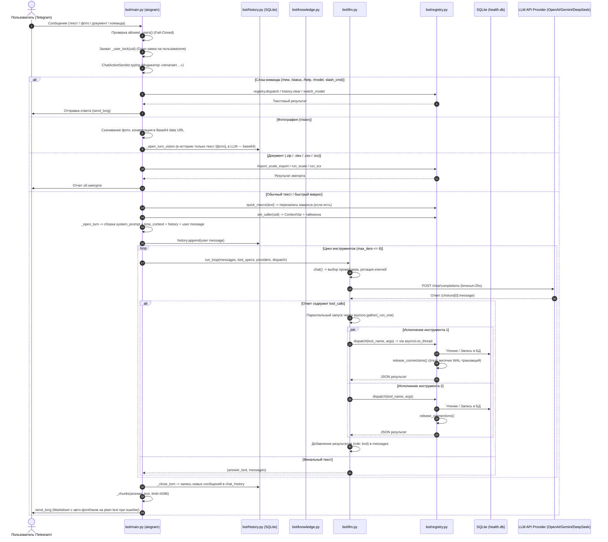

# Архитектурный и кодовый анализ агентного цикла Telegram-бота (`bot/`)

Данный документ содержит исчерпывающий технический анализ подсистемы автономного агентного цикла Telegram-бота (`bot/`), пришедшей на смену внешнему шлюзу Hermes. Анализ охватывает все 5 ключевых файлов подсистемы:
1. `bot/main.py` (740 строк) — точка входа, диспетчер aiogram, оркестрация обработки сообщений, фото (Vision), документов (импорт весов/TCX), слэш-команд, блокировок пользователей и вспомогательных процессов.
2. `bot/llm.py` (523 строки) — асинхронный HTTP-клиент OpenAI API, каскад LLM-провайдеров, пул и ротация API-ключей с кулдаунами, параллельный цикл вызова инструментов (`run_loop`).
3. `bot/registry.py` (291 строка) — реестр 30 инструментов и слэш-команд (мост к `plugin/tools.py`), локализованные описания для LLM, защита от утечек соединений SQLite (WAL deadlock prevention), часовые пояса пользователей.
4. `bot/history.py` (156 строк) — постоянное хранилище контекста диалога в SQLite (`chat_history`), двухуровневая обрезка (по количеству сообщений и символам) с контролем валидности структуры диалога.
5. `bot/knowledge.py` (243 строки) — динамическая база знаний (`Knowledge/`), разграничение прав доступа (режимы admin/user), поиск по абзацам для больших файлов (>20 KB), защита от обхода путей (Path Traversal).

---

## 1. Сквозной цикл обработки сообщений (End-to-End Agent Loop)

Взаимодействие пользователя с ботом строится вокруг строгого асинхронного конвейера.



---

## 2. Детальный разбор компонентов и файлов

### 2.1. `bot/main.py`

Точка входа и главный оркестратор подсистемы. Заменяет шлюз Hermes. Работает на библиотеке `aiogram 3.x`.

#### 2.1.1. Сигнатуры функций и методов

- `system_prompt() -> str`:
  Считывает системный промпт из `Core/system_promt.md` с кэшированием по `st_mtime`. Динамически присоединяет актуальный индекс базы знаний `knowledge.index()`.
- `tool_specs() -> list[dict]`:
  Формирует полный перечень спецификаций инструментов формата OpenAI. Включает 30 инструментов из `registry.openai_tools()` и динамический инструмент `knowledge` со схемой из `knowledge.schema()`.
- `dispatch(name: str, args: dict) -> str`:
  Маршрутизирует вызов инструмента: `knowledge` исполняется локально в модуле `knowledge.read`, остальные вызовы перенаправляются в `registry.dispatch`.
- `allowed_users() -> set[str]`:
  Считывает переменную окружения `TELEGRAM_ALLOWED_USERS`. При пустом значении возвращает пустое множество (политика Fail-Closed: доступ закрыт всем).
- `_chunks(text: str, limit: int) -> list[str]`:
  Разбивает длинные сообщения на части длиной не более `limit` (4096 символов). Разбивка производится строго по границам двойных переносов строк `\n\n` (по абзацам), что предотвращает разрушение форматирования таблиц и статус-баров.
- `async send_long(message: Message, text: str) -> None`:
  Отправляет сообщение пользователю по частям. Если текст пуст, подставляет `"Готово."`. Обрабатывает исключение `TelegramBadRequest` (возникающее из-за невалидного Markdown от LLM): при ошибке логирует предупреждение и переотправляет фрагмент как безопасный HTML (`html.escape(chunk), parse_mode=None`).
- `_plain(raw: str) -> str`:
  Преобразует структурированный ответ инструментов в читаемый текст. Если ответ — JSON с полями `text`, `help`, `status_bar` или `error`, возвращает строковое значение этого поля.
- `admin_user_ids() -> set[str]`:
  Извлекает список идентификаторов администраторов Telegram из `config.yaml` (`admin.telegram_admin_ids`).
- `_format_models_message(providers: list[dict]) -> str`:
  Формирует Markdown-сообщение со списком доступных моделей и выделением активной (приоритет #1).
- `_model_keyboard(providers: list[dict]) -> InlineKeyboardMarkup`:
  Генерирует инлайн-клавиатуру для переключения приоритетной модели (`callback_data="switch_model:<idx>"`).
- `switch_model_cmd(args: str) -> str`:
  Обрабатывает текстовую команду смены модели `/model <номер|название>`. Перемещает выбранную модель на нулевую позицию в списке `providers` и сохраняет изменения в `config.yaml` через `admin.server._update_providers_in_config`.
- `run_command(uid: str, text: str) -> str | None`:
  Выполняет встроенные команды бота без обращения к LLM: `/new` (очистка контекста диалога через `history.clear`), `/status` (вызов `get_status_bar`), `/help` (вызов `help`), `/model` (для администраторов), а также слэш-команды плагина из `registry.SLASH_COMMANDS`. В блоке `finally` гарантированно вызывает `registry.release_connections()`.
- `_user_time_context(conn, uid: str) -> str`:
  Определяет часовой пояс пользователя из таблицы `users`, вычисляет локальное время (`config.user_now` или `config.local_now`) и формирует блок системного контекста:
  `[CURRENT TIME & DATE]` с жестким указанием текущего года (`ТЕКУЩИЙ ГОД: YYYY! Ни в коем случае не используй 2025 или 2024...`).
- `_open_turn(uid: str, text: str) -> list[dict]`:
  Синхронная функция (запускается через `asyncio.to_thread`). Открывает соединение с БД, выполняет миграции, генерирует контекст времени, собирает список сообщений (`system_prompt` + `time_context` + история из `history.load` + реплика пользователя) и сразу сохраняет реплику в БД через `history.append`.
- `_open_turn_vision(uid: str, content: list[dict], text_for_history: str) -> list[dict]`:
  Аналог `_open_turn` для мультимодальных Vision-запросов. В модель передается структура `content` с base64-кодированным изображением, а в постоянную историю SQLite записывается только текстовая подпись `text_for_history` (`[фото]` или caption), исключая раздувание базы гигабайтами base64.
- `_close_turn(uid: str, new_messages: list[dict]) -> None`:
  Синхронная функция (запускается через `asyncio.to_thread`). Записывает все новые сообщения, сгенерированные за время хода (вызовы инструментов, ответы инструментов, финальный ответ ассистента), в таблицу `chat_history`.
- `_user_lock(uid: str) -> asyncio.Lock`:
  Возвращает объект `asyncio.Lock`, уникальный для каждого `telegram_user_id`. Предотвращает состояние гонки (Race Condition), когда быстрые повторные сообщения от одного пользователя перепутывают порядок записей в истории.
- `async _handle_document(message: Message, uid: str) -> None`:
  Обрабатывает входящие файлы. Загружает файл во временную директорию. Если файл является ZIP-архивом, распаковывает его и запускает парсеры весов (`migrate.run_scale`) и тренировок (`migrate.run_tcx`). Если файл одиночный (XLSX, CSV, TCX), вызывает инструмент `import_scale_export`.
- `async _handle_photo(message: Message, session: aiohttp.ClientSession, cfg: dict, uid: str) -> None`:
  Обрабатывает фотографии. Скачивает максимальное разрешение, преобразует в Base64 data URL, собирает мультимодальный промпт и запускает цикл `llm.run_loop`.
- `async handle_message(message: Message, session: aiohttp.ClientSession, cfg: dict) -> None`:
  Главный диспетчер входящих апдейтов. Проверяет авторизацию (`allowed_users`), маршрутизирует документ, фото или текст под замком пользователя `_user_lock` и контекстным менеджером `ChatActionSender.typing`.
- `async _handle_turn(message: Message, session: aiohttp.ClientSession, cfg: dict, uid: str, text: str) -> None`:
  Оркестрирует текстовый ход: устанавливает caller ID и таймзону через `registry.set_caller`, проверяет слэш-команды, применяет быстрые макросы `quick_macro`, открывает ход, запрашивает LLM и сохраняет результат.
- `_admin_port_busy(host: str, port: int) -> bool`:
  Проверяет занятость TCP-порта через `connect_ex` с таймаутом 0.5 секунды.
- `_start_admin_panel() -> subprocess.Popen | None`:
  Запускает веб-админку (`admin.server`) отдельным процессом ОС (`subprocess.Popen`). Изоляция процессов предотвращает конфликт monkey-patching'а подключений к SQLite между ботом и панелью.
- `_stop_admin_panel(proc: subprocess.Popen | None) -> None`:
  Корректно останавливает админку (`terminate` с ожиданием до 5 секунд, затем `kill`).
- `async main() -> int`:
  Точка входа: инициализация логирования (`force=True`), проверка окружения (`TELEGRAM_BOT_TOKEN`, `TELEGRAM_ALLOWED_USERS`, `bot.providers`), инициализация экземпляров `Bot` и `Dispatcher`, старт админки и запуск поллинга.
- `async _run_polling(bot: Bot, dp: Dispatcher, cfg: dict) -> int`:
  Регистрирует хэндлеры сообщений и callback-кнопок, регистрирует меню команд в Telegram с таймаутом 10 секунд (не блокируя старт при сетевых сбоях) и начинает опрос серверов Telegram (`dp.start_polling`).

#### 2.1.2. Константы и конфигурация
- `SOUL_PATH = ROOT / "Core" / "system_promt.md"` — путь к базовому промпту персоны.
- `TELEGRAM_LIMIT = 4096` — лимит длины текстового сообщения в Telegram.
- `BUILTIN_COMMANDS` — словарь встроенных команд (`new`, `help`, `status`, `model`).
- `_soul_cache: tuple[float, str] | None` — кэш содержимого промпта с меткой времени модификации файла (mtime).
- `_USER_LOCKS: dict[str, asyncio.Lock]` — словарь блокировок пользователей в памяти.

---

### 2.2. `bot/llm.py`

Модуль взаимодействия с языковыми моделями. Реализует каскадный отказ (failover), ротацию пула API-ключей, разбор специфических ошибок rate-limit и параллельный цикл вызова инструментов.

#### 2.2.1. Сигнатуры и классы

- `class Provider(TypedDict, total=False)`:
  Спецификация провайдера модели:
  - `base_url: str`
  - `api_key_env: str`
  - `model: str`
  - `api_keys: list[str]` (опционально)
  - Дополнительные параметры генерации: `max_tokens`, `temperature`, `top_p`, `reasoning_effort`, `seed`, `chat_template_kwargs`, `extra_body`, `extra_payload`, `disable_tools`.
- `class KeyState`:
  Хранит состояние здоровья конкретного API-ключа:
  - `cooldown_until: float` — unix-время окончания кулдауна.
  - `failure_count: int` — счетчик последовательных ошибок.
  - `last_status: int | None` — HTTP статус последнего ответа.
  - `last_error: str | None` — текст последней ошибки.
- `_mask_key(key: str) -> str`:
  Маскирует API-ключ для безопасного вывода в логи (оставляет только последние 4 символа: `...a1b2`).
- `get_provider_keys(provider: Provider) -> list[str]`:
  Извлекает все доступные ключи провайдера:
  1. Из поля `api_keys` провайдера.
  2. Из переменной окружения `api_key_env`.
  3. Из вариантов с суффиксами: `{ENV}S`, `{ENV}_LIST`.
  4. Из нумерованных переменных `{ENV}_1` ... `{ENV}_19`.
  Поддерживает разделение запятыми, точками с запятой и переносами строк; игнорирует комментарии (`#`).
- `_get_key_state(key: str) -> KeyState`:
  Возвращает (или инициализирует) объект `KeyState` для ключа.
- `_ordered_keys(env_name: str, keys: list[str]) -> list[str]`:
  Сортирует ключи для запроса:
  - Смещает стартовый индекс по Round-Robin алгоритму (`_ROTATION_INDEX[env_name]`).
  - Разделяет ключи на «здоровые» (`cooldown_until <= now`) и «на кулдауне» (`cooldown_until > now`).
  - Сортирует ключи на кулдауне по времени скорейшего восстановления.
  - Возвращает конкатенацию `healthy + cooling`.
- `async _post(session: aiohttp.ClientSession, url: str, headers: dict, payload: dict) -> tuple[int, dict]`:
  Низкоуровневая отправка POST-запроса через `aiohttp`. Таймауты: `total=25` секунд, `sock_connect=5` секунд. Безопасно разбирает JSON; при некорректном JSON возвращает сырой текст в ключе `raw`.
- `_parse_retry_delay(body: Any, default: float = 60.0) -> float`:
  Извлекает требуемое время ожидания из тела ошибки 429:
  - Ищет `error.details[].retryDelay` (специфика Google Gemini API, e.g. `"14.5s"`).
  - Ищет регулярным выражением `retry in ([\d\.]+)s` в тексте ошибки.
  - Ограничивает минимальный порог снизу: `max(5.0, delay)`.
- `async def chat(session: aiohttp.ClientSession, messages: list[dict], tools: list[dict], providers: list[Provider]) -> dict`:
  Выполняет одиночный запрос к каскаду провайдеров.
  - Очищает сообщения (корректирует `content` у сообщений с `tool_calls` для совместимости с OpenAI API).
  - Отключает инструменты для моделей `gemma*` или при флаге `disable_tools: true`.
  - Перебирает провайдеров, а внутри провайдера — упорядоченные ключи.
  - Пропускает ключ на кулдауне, если доступны другие ключи.
  - Реакция на HTTP-коды:
    - `200`: сброс кулдауна ключа (`cooldown_until = 0.0`), возврат `choices[0].message`.
    - `404`: модель не найдена — кулдаун ключа на 24 часа (`86400 с`) и переход к **следующему провайдеру** (`break`).
    - `429`: лимит квоты/рейтлимит — расчет кулдауна через `_parse_retry_delay`, немедленный переход к **следующему ключу** текущего провайдера.
    - `401, 403`: ошибка авторизации — кулдаун ключа на 1 час (`3600 с`), переход к **следующему ключу**.
    - `400, 422`: ошибка схемы запроса (неподдерживаемый thinking/tools) — переход к **следующему провайдеру** (`break`).
    - Сетевые ошибки / таймаут: фиксация ошибки, попытка следующего ключа/провайдера.
  - Если все провайдеры исчерпаны, выбрасывает `RuntimeError` со сводкой всех сбоев.
- `_short(value: Any, limit: int = 300) -> str`:
  Форматирует и обрезает длинные строки и аргументы для информативного логирования без засорения логов.
- `async def _run_one(call: dict, dispatch: Callable[[str, dict], str]) -> str`:
  Исполняет один вызов инструмента:
  - Извлекает имя функции и аргументы `raw_args`.
  - Парсит JSON аргументов. При `json.JSONDecodeError` возвращает JSON с ключом `error`, передавая ошибку обратно модели для исправления, не роняя агентный цикл.
  - Запускает `dispatch` в отдельном потоке ОС через `await asyncio.to_thread(dispatch, name, args)`.
- `async def run_loop(session: aiohttp.ClientSession, messages: list[dict], tools: list[dict], providers: list[Provider], dispatch: Callable[[str, dict], str], max_iters: int = 6) -> tuple[str, list[dict]]`:
  Главный цикл агента (ReAct loop):
  - Выполняет до `max_iters` итераций (по умолчанию 6).
  - Вызывает `chat()`.
  - Извлекает финальный текст из `content` (или `reasoning_content`/`reasoning` при отсутствии `content`).
  - Если `tool_calls` отсутствуют — завершает цикл и возвращает текст и историю.
  - При наличии `tool_calls` запускает их параллельное исполнение через `asyncio.gather(*(_run_one(call, dispatch) for call in tool_calls))`.
  - Оборачивает результаты в сообщения `role: "tool"` с соответствующими `tool_call_id` и добавляет их в историю.
  - При превышении `max_iters` возвращает предупреждение о незавершении цикла за отведенное число шагов.

---

### 2.3. `bot/registry.py`

Реестр инструментов и связующий слой с бизнес-логикой `plugin/tools.py`.

#### 2.3.1. Архитектурные особенности и сигнатуры

- `DESCRIPTIONS: dict[str, str]`:
  Словарь качественных описаний на русском языке для всех 30 инструментов плагина. Необходим потому, что внутренний декоратор `@_handler_wrapper` в `plugin/tools.py` не использовал `functools.wraps`, из-за чего оригинальные docstrings функций стирались, лишая LLM понимания назначения инструментов.
- `class _RegistryCtx`:
  Шим-объект контекста регистрации, реализующий методы `register_tool`, `register_hook`, `register_command` для контракта `plugin.tools.register(ctx)`.
- `_build() -> None`:
  Вызывает `_tools.register(ctx)` и наполняет глобальный словарь `TOOLS`. Проверяет наличие каждого зарегистрированного инструмента в `DESCRIPTIONS` (при отсутствии падает на старте с `KeyError`, предотвращая запуск неполной системы).
- `openai_tools() -> list[dict]`:
  Формирует список спецификаций инструментов в формате `{"type": "function", "function": {"name": ..., "description": ..., "parameters": ...}}`.
- Механизм защиты от утечек транзакций SQLite (WAL Deadlock Prevention):
  - `_leaked = threading.local()` — локальное хранилище открытых соединений для каждого потока пула.
  - `_real_connect = _tools.connect` — сохранение оригинальной функции подключения.
  - `_tracking_connect()` — перехватчик `_tools.connect`, автоматически регистрирующий каждое открытое соединение в `_leaked.conns`. Подменяется через `_tools.connect = _tracking_connect`.
  - `release_connections() -> None`: перебирает все соединения в `_leaked.conns`, выполняет `conn.rollback()` и `conn.close()`, после чего очищает список. Устраняет критическую проблему архитектуры плагина: когда хэндлер падал на `INSERT` (например, нарушение FOREIGN KEY), соединение оставалось с незакрытой пишущей транзакцией, блокируя всю базу данных (`database is locked` на 5 секунд для всех последующих операций в WAL-режиме).
- `dispatch(name: str, args: dict) -> str`:
  Точка входа исполнения инструмента. Проверяет наличие инструмента в `TOOLS` (при отсутствии возвращает JSON `{"error": "unknown tool"}`). Вызывает хэндлер, а в блоке `finally` гарантированно вызывает `release_connections()`.
- `set_caller(telegram_id: str) -> None`:
  Записывает `telegram_id` в `ContextVar` `_tools._CALLER_FALLBACK` (поскольку шлюз Hermes удален). Заодно устанавливает глобальный часовой пояс через `config.set_tz(_tz_of(telegram_id))`.
- `@lru_cache(maxsize=64) def _tz_of(telegram_id: str) -> str | None`:
  Кэшированный запрос часового пояса из таблицы `users`. Исключает лишние дисковые обращения при каждом сообщении.
- `quick_macro(text: str) -> str | None`:
  Делегирует проверку текста быстрого макроса в `_tools._quick_macro_rewrite(text)` (например, превращение `+30 белка` в команду логирования).

---

### 2.4. `bot/history.py`

Подсистема долговременного хранения истории диалога в SQLite и управления контекстным окном.

#### 2.4.1. Сигнатуры и алгоритмы

- `_now_iso() -> str`:
  Возвращает текущую временную метку в формате `"YYYY-MM-DD HH:MM:SS"`.
- `_ensure_table(conn) -> None`:
  Создает таблицу `chat_history` и индекс:
  ```sql
  CREATE TABLE IF NOT EXISTS chat_history (
      telegram_user_id TEXT,
      ts TEXT,
      role TEXT,
      content TEXT
  );
  CREATE INDEX IF NOT EXISTS idx_chat_history_user ON chat_history(telegram_user_id);
  ```
- `_bot_config() -> tuple[int, int]`:
  Считывает параметры `history_window` (по умолчанию 20) и `history_chars` (по умолчанию 8000) из секции `bot` файла `config.yaml`.
- `_trim(rows: list, window: int, chars: int) -> list`:
  Критически важный алгоритм обрезки контекстного окна:
  1. Оставляет срез последних `window` строк: `rows[-window:]`.
  2. Подсчитывает суммарную длину символов в JSON-строках `content`. Пока суммарная длина превышает `chars`, удаляет старейшие сообщения с начала списка.
  3. **Контроль границы хода (Turn Boundary Invariant)**:
     ```python
     while tail and tail[0]["role"] != "user":
         tail = tail[1:]
     ```
     Список сообщений обязан начинаться с роли `"user"`. Если при срезке в начале списка оказывается сообщение роли `"tool"` или `"assistant"` (например, ответ на вызов инструмента без самого сообщения с вызовом), внешние LLM API (OpenAI, Anthropic, Gemini) отклоняют весь запрос с кодом HTTP 400. Алгоритм сдвигает начало окна вперед до ближайшего пользовательского сообщения.
- `load(conn, telegram_id: str) -> list[dict]`:
  Загружает историю диалога пользователя:
  ```sql
  SELECT ts, role, content FROM chat_history WHERE telegram_user_id=? ORDER BY rowid ASC
  ```
  Применяет `_trim` и десериализует сообщения из JSON.
- `append(conn, telegram_id: str, message: dict) -> None`:
  Сериализует сообщение целиком в JSON и сохраняет в БД:
  ```sql
  INSERT INTO chat_history(telegram_user_id, ts, role, content) VALUES (?, ?, ?, ?)
  ```
  Вызывает `conn.commit()`.
- `clear(conn, telegram_id: str) -> None`:
  Очищает историю конкретного пользователя по команде `/new`:
  ```sql
  DELETE FROM chat_history WHERE telegram_user_id=?
  ```
  Вызывает `conn.commit()`.

---

### 2.5. `bot/knowledge.py`

Инструмент динамического доступа к базе знаний (`Knowledge/`).

#### 2.5.1. Сигнатуры и алгоритмы

- `KNOWLEDGE_DIR = Path(...) / "Knowledge"` — директория со справочными материалами.
- Пороги:
  - `_FULL_LIMIT = 20 * 1024` (20 КБ) — максимальный размер файла, отдаваемого целиком.
  - `_SEARCH_LIMIT = 8 * 1024` (8 КБ) — максимальный объем выборки абзацев по поисковому запросу.
- `_is_admin() -> bool`:
  Проверяет, включен ли у текущего вызывающего режим администратора (`_tools._get_mode(...) == "admin"`).
- `_topics() -> list[Path]`:
  Сканирует каталог `Knowledge/` на наличие файлов `.md` и `.txt` **при каждом вызове** (файлы могут добавляться пользователем через веб-админку без перезапуска бота). При совпадении имен приоритет отдается `.md`. Если пользователь не является администратором, файл `admin_commands` исключается из списка.
- `_describe(text: str) -> str`:
  Извлекает первую содержательную строку документа для индекса:
  - Пропускает YAML frontmatter (блок между `---` и `---`).
  - Пропускает Markdown-заголовки (`#`), строки с разделителями таблиц (`|`).
  - Пропускает строки короче 10 символов и артефакты PDF-экстракции в верхнем регистре короче 40 символов.
  - Обрезает результат до 100 символов.
- `index() -> str`:
  Формирует текстовый перечень доступных статей с описаниями в формате `- **<topic>** — <description>`.
- `schema() -> dict`:
  Динамически генерирует схему инструмента OpenAI: поле `topic` содержит строгий `enum` из доступных на данный момент тем.
- `_resolve(topic: str) -> Path | None`:
  Защита от Path Traversal. Проверяет, что вычисленный абсолютный путь находится строго внутри директории `KNOWLEDGE_DIR` (`candidate.relative_to(base)`). Предотвращает утечку конфиденциальных файлов (например, `../../.env`).
- `read(topic: str, query: str | None = None) -> str`:
  Логика чтения темы:
  1. Блокирует доступ к `admin_commands` для не-администраторов.
  2. Если размер файла <= 20 КБ, возвращает текст целиком.
  3. Если размер файла > 20 КБ и параметр `query` не передан, возвращает инструкцию передать подстроку поиска.
  4. При наличии `query`: разбивает документ на абзацы (`text.split("\n\n")`), находит все абзацы, содержащие подстроку (без учета регистра), собирает их в буфер размером до 8 КБ и указывает количество оставшихся совпадений.

---

## 3. Сводная таблица констант, порогов и ограничений

| Компонент | Константа / Параметр | Значение | Назначение |
| :--- | :--- | :--- | :--- |
| `main.py` | `TELEGRAM_LIMIT` | 4096 симв. | Максимальный размер одного сообщения в Telegram API |
| `main.py` | Таймаут `set_my_commands` | 10 сек. | Предотвращение зависания запуска бота при сетевых сбоях Telegram |
| `main.py` | Таймаут остановки админки | 5 сек. | Время ожидания `terminate` перед принудительным `kill` |
| `llm.py` | Таймаут HTTP-клиента | `total=25s, sock_connect=5s` | Предотвращение зависания на недоступных API-шлюзах |
| `llm.py` | Кулдаун при 404 (Not Found) | 86400 сек. (24 ч) | Временная деактивация ключа несуществующей/закрытой модели |
| `llm.py` | Кулдаун при 401/403 (Auth Error)| 3600 сек. (1 ч) | Временная деактивация недействительного ключа |
| `llm.py` | Минимальный кулдаун при 429 | 5.0 сек. | Нижняя граница времени ожидания при исчерпании квоты |
| `llm.py` | По умолчанию кулдаун при 429 | 60.0 сек. | Значение при отсутствии заголовка/поля `retryDelay` |
| `llm.py` | `max_iters` в `run_loop` | 6 итераций | Защита от бесконечного зацикливания вызовов инструментов |
| `history.py` | `_DEFAULT_WINDOW` | 20 сообщений | Базовый размер скользящего окна истории диалога |
| `history.py` | `_DEFAULT_CHARS` | 8000 символов | Максимальный объем символов контекста диалога |
| `knowledge.py`| `_FULL_LIMIT` | 20 КБ (20480 байт) | Максимальный размер файла для выдачи целиком без поиска |
| `knowledge.py`| `_SEARCH_LIMIT` | 8 КБ (8192 байт) | Лимит выдачи результатов подстрочного поиска по абзацам |
| `knowledge.py`| Ограничение описания | 100 символов | Длина сниппета статьи в `knowledge.index()` |

---

## 4. SQL-взаимодействия и структура базы данных

Модули агентного цикла выполняют следующие прямые запросы к SQLite:

1. **Создание инфраструктуры истории диалога (`bot/history.py`)**:
   ```sql
   CREATE TABLE IF NOT EXISTS chat_history (
       telegram_user_id TEXT,
       ts TEXT,
       role TEXT,
       content TEXT
   );
   CREATE INDEX IF NOT EXISTS idx_chat_history_user ON chat_history(telegram_user_id);
   ```
2. **Чтение истории пользователя (`bot/history.py`)**:
   ```sql
   SELECT ts, role, content FROM chat_history 
   WHERE telegram_user_id = ? 
   ORDER BY rowid ASC;
   ```
3. **Запись сообщения в историю (`bot/history.py`)**:
   ```sql
   INSERT INTO chat_history (telegram_user_id, ts, role, content) 
   VALUES (?, ?, ?, ?);
   ```
4. **Очистка истории пользователя (`bot/history.py`)**:
   ```sql
   DELETE FROM chat_history WHERE telegram_user_id = ?;
   ```
5. **Определение часового пояса и ID пользователя (`bot/main.py`, `bot/registry.py`)**:
   ```sql
   SELECT id, timezone FROM users WHERE telegram_user_id = ?;
   ```

---

## 5. Анализ надежности: выявленные риски, баги и архитектурные ограничения

В ходе глубокого аудита исходного кода выявлены следующие потенциальные проблемы:

### 5.1. Потенциальная утечка памяти в `_USER_LOCKS` (`bot/main.py`)
- **Проблема**: Словарь `_USER_LOCKS: dict[str, asyncio.Lock] = {}` никогда не очищается.
- **Последствие**: Для каждого уникального пользователя Telegram создается объект `asyncio.Lock`, остающийся в памяти на все время жизни процесса. В текущей конфигурации с закрытым списком (`allowed_users`) это некритично, но при расширении доступа или публичном режиме приведет к постепенной утечке памяти.

### 5.2. Устаревание кэша таймзоны в `_tz_of` (`bot/registry.py`)
- **Проблема**: Функция `_tz_of` снабжена декоратором `@lru_cache(maxsize=64)`.
- **Последствие**: Если пользователь меняет свой часовой пояс через веб-панель или команду настроек профиля, бот продолжает использовать старый закэшированный часовой пояс до полного перезапуска процесса. Рекомендуется предусмотреть механизм сброса кэша (`_tz_of.cache_clear()`).

### 5.3. Неограниченный рост таблицы `chat_history` (`bot/history.py`)
- **Проблема**: В таблице `chat_history` отсутствуют механизмы автоматической ротации (TTL / автоочистки старых записей). Очистка происходит только по явной команде `/new`.
- **Последствие**: Запрос `SELECT ts, role, content FROM chat_history WHERE telegram_user_id=? ORDER BY rowid ASC` при каждом сообщении считывает из базы абсолютно все сообщения пользователя за все месяцы/годы, после чего функция `_trim` отбрасывает всё, кроме последних 20 записей. При активном использовании базы через несколько месяцев размер выборки и расход CPU/памяти на десериализацию JSON заметно вырастут.
- **Решение**: Использовать выборку с конца: `SELECT ts, role, content FROM (SELECT rowid, ts, role, content FROM chat_history WHERE telegram_user_id=? ORDER BY rowid DESC LIMIT 50) ORDER BY rowid ASC`.

### 5.4. Состояние гонки в SQLite при параллельных вызовах инструментов (`bot/llm.py`)
- **Проблема**: В функции `run_loop` несколько вызовов инструментов исполняются параллельно:
  ```python
  results = await asyncio.gather(*(_run_one(call, dispatch) for call in tool_calls))
  ```
  Каждый вызов `_run_one` запускается в пуле потоков через `asyncio.to_thread`.
- **Последствие**: Если модель в одном ходе решает вызвать сразу два пишущих инструмента (например, одновременно `log_food` и `log_water`), два параллельных потока одновременно начинают транзакции записи в один файл SQLite. Несмотря на режим WAL, при интенсивной записи или задержках диска это может приводить к ошибкам `sqlite3.OperationalError: database is locked`.

### 5.5. Рассинхронизация контекста диалога при полном сбое LLM (`bot/main.py`)
- **Проблема**: В методе `_handle_turn` функция `_open_turn` сразу записывает сообщение пользователя в базу данных:
  ```python
  prefix = await asyncio.to_thread(_open_turn, uid, text)
  ```
  Если после этого обращение к LLM терпит неудачу (выброшен `RuntimeError: Все провайдеры упали`), управление переходит в блок `except`, и функция `_close_turn` не вызывается.
- **Последствие**: Реплика пользователя остается в таблице `chat_history` без ответа ассистента. При следующем запросе пользователя в истории окажутся две последовательные реплики `user`, что нарушает привычную очередность ходов и может вызвать неадекватную реакцию некоторых строгих моделей.

### 5.6. Синхронный оверхед дискового I/O в `knowledge.py`
- **Проблема**: Метод `system_prompt()` вызывает `knowledge.index()`, который при **каждом сообщении каждого пользователя** заново сканирует каталог `Knowledge/` и построчно читает все файлы `.md` и `.txt` для извлечения описаний `_describe`.
- **Последствие**: Хотя это обеспечивает мгновенное появление новых файлов без перезапуска, при росте базы знаний до десятков и сотен документов это создаст заметную задержку на дисковые операции перед каждым вызовом LLM.

### 5.7. Ограничение пула нумерованных ключей (`bot/llm.py`)
- **Проблема**: В `get_provider_keys` цикл поиска нумерованных переменных окружения жестко ограничен: `range(1, 20)`. Ключи с номерами 20 и выше будут проигнорированы.
