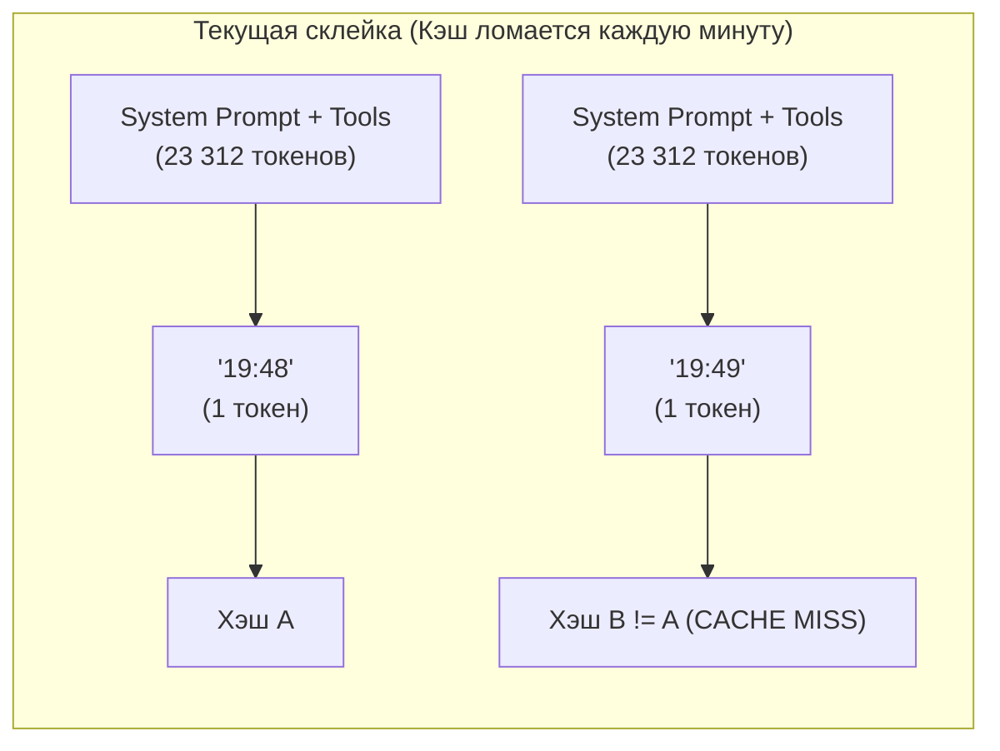
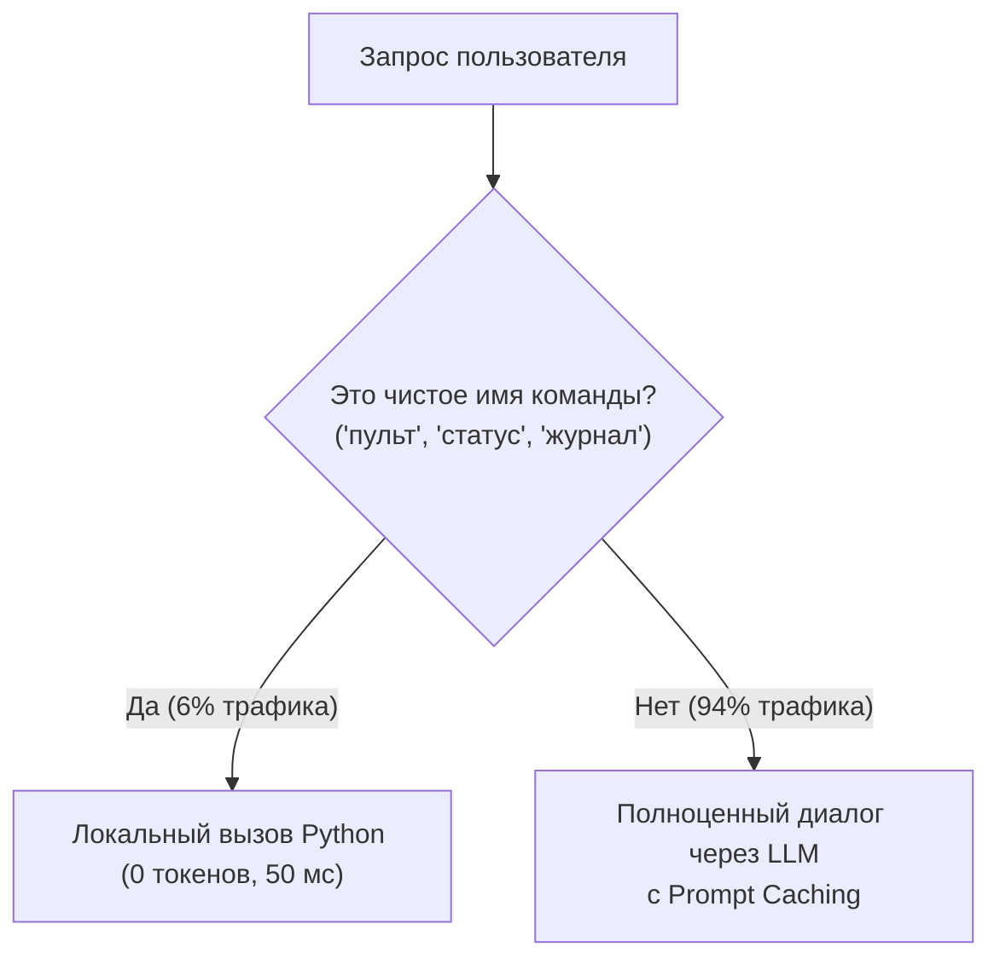

# Комплексный анализ: Кеширование системных инструкций и оптимизация вызовов LLM

## 1. Введение и контекст

Система **Health Agent System** представляет собой многофункционального метаболического коуча и аналитика здоровья в Telegram. 
На основе анализа **2 510 сообщений** (642 диалоговых хода пользователя за 16 активных дней из реальной базы данных `health.db`) проведён глубокий аудит расхода токенов, работы контекста и возможностей оптимизации.

> [!IMPORTANT]
> **Главный вывод исследования:**
> **98.6% всех токенов системы — это входные токены (Input Tokens)**. При этом **~90% входных токенов — это статическая неизменяемая база** (системный промпт + 35 спецификаций инструментов = **23 312 токенов**).
> Включение правильного **Prompt Caching** снижает эффективный расход токенов и стоимость на **~80–85%**, не требуя изменения логики диалога, обрезки промптов или отказа от возможностей моделей.

---

## 2. Анатомия базового контекста (Точные замеры)

Каждый запрос к любой языковой модели в цикле `bot/llm.py` передаёт:

| Компонент | Источник | Символов | Токенов (BPE cl100k) | Доля в базе |
| :--- | :--- | :--- | :--- | :--- |
| **Системный промпт (Soul)** | `Core/system_promt.md` | 20 498 | **9 136** | 39.2% |
| **Индекс знаний** | `bot/knowledge.py:index()` | 1 643 | **790** | 3.4% |
| **Спецификации 35 инструментов** | `bot/registry.py:openai_tools()` | 37 437 | **13 386** | 57.4% |
| **Итого статическая база** | — | **59 578** | **23 312** | **100%** |
| **История диалога (динамика)** | `bot/history.py` (до 20 сообщ.) | ~4 000 – 8 000 | **~1 500 – 2 500** | — |
| **Реплика пользователя** | Telegram message | ~50 – 300 | **~20 – 100** | — |
| **ИТОГО 1-й вызов LLM** | — | **~65 000** | **~25 000 – 26 000** | — |

### Механика хода с инструментами (Tool Loop)
В ~65% случаев пользователь пишет о еде, воде, весе или статусе. В этом случае бот выполняет **два последовательных вызова LLM**:
1. **Вызов 1 (25 400 токенов):** Модель анализирует сообщение и возвращает `tool_calls` (например, `log_food`).
2. **Исполнение тула:** Python локально записывает данные в SQLite и возвращает результат (~500–1000 токенов).
3. **Вызов 2 (26 200 токенов):** Модели повторно отправляется **весь исходный контекст + вызов тула + результат тула**, чтобы она сгенерировала текст подтверждения.

> **Суммарный расход на 1 ход пользователя с логированием:** **~51 600 входных токенов**.

---

## 3. Почему автоматическое кеширование НЕ работает сейчас

Современные провайдеры LLM (Anthropic, DeepSeek, OpenAI, Google) поддерживают **KV-кэширование префиксов** (Prefix / Prompt Caching). Однако в текущем коде бот теряет эту возможность по двум архитектурным причинам:

### Причина 1: Префиксная нестабильность (Minute Invalidation)
В файле `bot/main.py` функция `_open_turn` формирует системный контекст следующим образом:
```python
# bot/main.py:594-595
time_ctx = _user_time_context(conn, uid)
prefix = [{"role": "system", "content": system_prompt() + time_ctx}]
```
А внутри `_user_time_context`:
```python
# bot/main.py:574
f"Текущая дата и время пользователя: {u_now.strftime('%Y-%m-%d %H:%M')}{tz_info}."
```



* **Что происходит:** Системный промпт (9.9k токенов) и динамическое время склеены в **одну строку одного сообщения**.
* **Последствие:** Каждую минуту хэш первых 10 000 токенов меняется. Любой автоматический кэш (DeepSeek, OpenAI, vLLM) считает это совершенно новым промптом и сбрасывает кэш.

### Причина 2: Отсутствие маркера `cache_control` для Anthropic / OpenRouter
В отличие от DeepSeek и OpenAI, которые кэшируют префиксы автоматически:
* **Anthropic API (Claude 3.5 Sonnet, 3.7 Sonnet, Haiku, Opus)** и **OpenRouter** требуют явного указания точки кэширования:
  ```json
  "cache_control": {"type": "ephemeral"}
  ```
* В `bot/llm.py` запросы отправляются через стандартный OpenAI-формат без этого флага. Поэтому при переключении на Claude или OpenRouter кэширование **не включается вовсе**, списывая 100% стоимости за каждый запрос.

---

## 4. Как работает Prompt Caching у разных моделей

| Провайдер / Модель | Механизм кэширования | Мин. размер блока | Скидка на Input токенов | Время жизни кэша |
| :--- | :--- | :--- | :--- | :--- |
| **Claude 3.5 / 3.7 Sonnet** | Явный (`cache_control`) | 1 024 токена | **−90%** ($0.30 вместо $3.00) | 5 мин (автопродление) |
| **Claude 3.5 Haiku** | Явный (`cache_control`) | 2 048 токенов | **−90%** ($0.08 вместо $0.80) | 5 мин (автопродление) |
| **Claude 3 Opus** | Явный (`cache_control`) | 1 024 токена | **−90%** ($1.50 вместо $15.00) | 5 мин (автопродление) |
| **DeepSeek (V3 / R1)** | Автоматический (Prefix) | 64 токена | **−75% – 90%** | До 1 часа |
| **OpenAI (GPT-4o, 4o-mini)** | Автоматический (Prefix) | 1 024 токена | **−50%** | 5–10 мин |
| **Google Gemini (Flash)** | Implicit Context Cache | 32 768 токенов | Снижение латентности и квот | В рамках сессии |

> **Наш базовый контекст (23 312 токенов) идеально подходит под все провайдеры:** он в 10–20 раз превышает минимальный порог активации кэша (1024–2048 токенов).

---

## 5. Анализ возможности «Реже вызывать модель» (Call Reduction)

### 5.1. Анализ характера сообщений пользователей
Из 643 ходов в базе данных:
* **~43% сообщений — короткие (< 30 символов).**
* Из них:
  * **~6% (39 сообщений)** — строгие однословные запросы статуса (`пульт`, `статус`, `дашборд`, `журнал`, `помощь`).
  * **~37%** — короткие диалоговые фразы («записываем», «да», «удали дубли воды», «ещё 250 воды»).
  * **~57%** — полноценный диалог на естественном языке (*«в холодильнике сосиски вязанка сливушки остались ,надо бы както вписать их в рацион»*, *«я думаю двумя сосисками обойдемся...»*).

### 5.2. Оценка потенциала перехвата (Fast-Path)



1. **Строгие команды («пульт», «статус», «журнал»):**
   * Сейчас пользователь пишет `пульт` без слэша. Бот делает 2 вызова LLM (51k токенов) и тратит 12 секунд.
   * Локальный перехват даёт **0 токенов и 50 мс ответа**.
   * Экономия: ~2 млн токенов в месяц.

2. **Почему нельзя перехватывать логирование еды жесткими регулярками:**
   * Пользователь формулирует прием пищи сотнями разных способов (разбивка на блюда, ингредиенты, контекст «пока это только план», фаззи-поиск по холодильнику).
   * Попытка заменить LLM регулярками разрушит основную ценность системы как умного ассистента.
   * **Вывод:** Вся сила оптимизации логирования еды должна лежать в **Prompt Caching**, а не в отказе от LLM.

3. **Однопроходное подтверждение инструментов (One-shot Tool Confirm):**
   * Когда модель на Шаге 1 уже распознала еду и вызвала `log_food` / `log_water`:
   * Результат инструмента уже содержит готовую статус-строку и сводку.
   * Если для простых шаблонных записей отдавать сгенерированный шаблон вместо Шага 2 к LLM — это **устраняет 50% сетевых вызовов** на каждом логировании.

---

## 6. Матрица сравнительной эффективности сценариев

Сравнение рассчитано на основе среднего темпа базы (**40 сообщений пользователя / 76 вызовов LLM в день**):

| Параметр | Текущее состояние (Без кэша) | Сценарий 1: Prompt Caching (Prefix Fix + Cache Control) | Сценарий 2: Prompt Caching + Fast-Path команд | Сценарий 3: Caching + Fast-Path + One-shot Confirm |
| :--- | :--- | :--- | :--- | :--- |
| **Базовый контекст** | 23.3k (каждый раз un-cached) | 23.3k (кэшируется на 90%) | 23.3k (кэшируется на 90%) | 23.3k (кэшируется на 90%) |
| **Вызовов LLM в день** | 76 вызовов | 76 вызовов | **~71 вызов** (−6%) | **~42 вызова** (−45%) |
| **Физических токенов/день** | ~2,0 млн | ~2,0 млн | ~1,85 млн | ~1,10 млн |
| **Эффективных платных токенов** | **~2,0 млн / день** | **~380k / день (−81%)** | **~350k / день (−82%)** | **~210k / день (−89%)** |
| **Стоимость Sonnet 3.5/3.7** | ~$6.30 / день ($190/мес) | **~$1.35 / день ($40/мес)** | **~$1.25 / день ($37/мес)** | **~$0.75 / день ($22/мес)** |
| **Стоимость Haiku 3.5** | ~$1.68 / день ($50/мес) | **~$0.35 / день ($10/мес)** | **~$0.32 / день ($9/мес)** | **~$0.20 / день ($6/мес)** |
| **На сколько хватит 15 млн токенов** | **~7.5 дней** | **~39 дней (~1.3 мес)** | **~43 дня (~1.4 мес)** | **~71 день (~2.4 мес)** |

---

## 7. Готовый план внедрения (Архитектурный чек-лист)

Для будущей реализации (когда потребуется внести изменения) подготовлен поэтапный план:

### Этап 1: Стабилизация префикса (Prefix Stabilization)
* **Файл:** `bot/main.py`
* **Действие:** В `_open_turn` и `_open_turn_vision` разделить:
  ```python
  # До:
  prefix = [{"role": "system", "content": system_prompt() + time_ctx}]
  
  # После:
  prefix = [
      {"role": "system", "content": system_prompt()},
      {"role": "system", "content": time_ctx.strip()},
  ]
  ```
* **Эффект:** Первые 23 300 токенов становятся абсолютно статичными во времени. Включается автоматический кэш для OpenAI, DeepSeek, Google.

### Этап 2: Активация Prompt Caching для Anthropic / OpenRouter
* **Файл:** `bot/llm.py`
* **Действие:** В функции `chat()` при формировании `payload`:
  Если провайдер использует `openrouter.ai` или `anthropic`:
  Выставлять `"cache_control": {"type": "ephemeral"}` в первое системное сообщение и в последний инструмент.
* **Эффект:** Включение официального кэширования Claude со скидкой 90% на входные токены.

### Этап 3: Fast-Path для текстовых команд
* **Файл:** `bot/main.py`
* **Действие:** В начале `_handle_turn` добавить проверку точных совпадений для `пульт`, `статус`, `дашборд`, `журнал`, `помощь` $\rightarrow$ прямой вызов соответствующих функций `registry.dispatch` с сохранением в `chat_history`.
* **Эффект:** Мгновенный ответ (50 мс) и 0 токенов на частые рутинные запросы.

---

## 8. Итоговый вывод исследования

1. **Кеширование системных инструкций — это наиболее эффективный рычаг.** Оно не требует ухудшения промпта или ограничений для пользователя, но сразу снижает расход и стоимость более чем в 5 раз.
2. **15 млн токенов** без кэширования сгорают за **~1 неделю**, а с настроенным кэшированием их хватит на **1.5 – 2.5 месяца** полноценной активной работы.
3. Кодовая база подготовлена к быстрому и чистому включению этих механизмов без нарушения обратной совместимости и существующих тестов.
