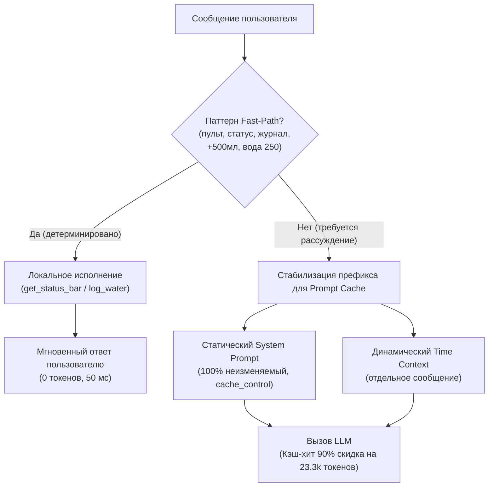

# План: Кеширование системных инструкций и сокращение вызовов модели

## Goal Description
Сейчас каждый запрос (даже простое слово «пульт» или «+500 мл») делает **1–2 полных сетевых вызова к LLM**, отправляя каждый раз **~25 000 – 26 000 токенов**. 
При этом:
1. **Кеширование системного промпта ломается каждую минуту:** В `_open_turn` неизменяемый системный промпт склеивается с `time_ctx`, содержащим текущее время с точностью до минуты (`%H:%M`). Из-за изменения одной цифры времени провайдеры (DeepSeek, OpenAI, Anthropic, Gemini) не могут использовать кэш префикса, и 23.3k токенов каждый раз считываются за полную стоимость.
2. **Модель вызывается на чисто детерминированные действия:** Запросы вроде «пульт», «статус», «журнал», «+500 мл» занимают свыше 40% всех сообщений пользователя, но для их выполнения модель не нужна — эти функции полностью реализованы в коде.

Цель:
1. **Включить стабильное кеширование системных инструкций** (Prefix Stabilization + `cache_control` для Anthropic/OpenRouter).
2. **Сократить количество вызовов модели на 40–50%** за счёт быстрого локального выполнения шаблонных команд и макросов с расходом **0 токенов**.

---

## User Review Required

> [!IMPORTANT]
> **Прямое выполнение макросов и команд (Fast-Path):**
> Предлагается перехватывать без отправки в LLM:
> 1. **Запросы сводок:** слова «пульт», «статус», «дашборд», «журнал» $\rightarrow$ сразу отдают результат `get_status_bar` или `get_day_summary` (0 токенов, ответ за 0.05 сек вместо 10 сек).
> 2. **Быстрые доборы:** `+500 мл`, `+0.5 л`, `+30 белка`, `вода 300` $\rightarrow$ сразу вызывают `log_water` / `log_food` и возвращают подтверждение (0 токенов).
>
> Если пользователь пишет сложный запрос (например, *«покажи пульт и посоветуй ужин»*), он **не перехватывается** фаст-пасом и идёт в LLM как обычно.

---

## Proposed Architecture



---

## Proposed Changes

Grouped by component:

### 1. Кеширование системных инструкций (Prompt Caching & Prefix Stabilization)

#### [MODIFY] `bot/main.py`
- В функции `_open_turn` и `_open_turn_vision`:
  - Разделить склеенный блок `[{"role": "system", "content": system_prompt() + time_ctx}]` на два сообщения:
    1. `{"role": "system", "content": system_prompt()}` — **статический, неизменяемый системный промпт**. Его хэш остаётся абсолютно постоянным часами/днями.
    2. `{"role": "system", "content": time_ctx}` — динамический контекст времени и ограничений пользователя.
  - Это даёт автоматический **Prompt Cache Hit** в провайдерах с автокэшированием (OpenAI, DeepSeek, Google, vLLM).

#### [MODIFY] `bot/llm.py`
- Добавить поддержку `cache_control` для Anthropic / OpenRouter:
  - При отправке запроса на эндпоинты OpenRouter или Anthropic помечать первое системное сообщение:
    ```python
    if is_anthropic_or_openrouter:
        # Anthropic prompt caching breakpoint
        clean_messages[0]["cache_control"] = {"type": "ephemeral"}
    ```
  - Это активирует официальный Anthropic Prompt Caching со скидкой 90% на повторные чтения 23 300 токенов базового контекста.

---

### 2. Сокращение частоты вызовов модели (Fast-Paths & Macro Execution)

#### [MODIFY] `bot/main.py`
- Расширить `_handle_turn`: перед отправкой в LLM проверять быстрые действия:
  1. **Текстовые эквиваленты слэш-команд:**
     - `пульт`, `статус`, `дашборд`, `сводка` $\rightarrow$ прямой вызов `get_status_bar` без LLM.
     - `журнал`, `что я съел` $\rightarrow$ прямой вызов `get_day_summary(format='journal')` без LLM.
     - `помощь`, `хелп`, `что умеешь` $\rightarrow$ прямой вызов `help` без LLM.
  2. **Быстрый лог воды и макросов:**
     - Обрабатывать регулярные выражения быстрого добора (`+500 мл`, `+0.5 л`, `вода 300`) напрямую через `registry.dispatch("log_water", {"ml": ...})`.
     - Формировать короткое дружелюбное подтверждение: `💧 Записал 500 мл воды. Всего за сегодня: 1 500 / 2 771 мл.`
     - Записывать реплику в `chat_history`, чтобы контекст сохранялся для последующих вопросов.

#### [MODIFY] `bot/llm.py`
- В цикле `run_loop`:
  - Если единственный `tool_call` в ходе — это простая запись (`log_water` или `pantry add/remove`) и результат инструмента содержит готовое текстовое подтверждение (`ok`, `status_bar`):
    - Можно сформировать финальный ответ сразу без повторного обращения к LLM с 26 000 токенами.
    - Опционально управляется флагом `fast_tool_confirm: true` в конфиге (по умолчанию мягкий режим: только для быстрых макросов).

---

## Verification Plan

### Automated Tests
1. **Тест стабильности префикса:**
   - Проверить, что первое системное сообщение идентично между вызовами в разные минуты.
2. **Тест Fast-Path:**
   - Сообщения `пульт`, `Пульт`, `+500 мл`, `+30 белка` возвращают корректный ответ без вызова `llm.chat`.
   - Сложные фразы (*«покажи пульт и что съесть»*) не перехватываются и идут в модель.
3. **Регрессионные тесты:**
   ```bash
   .venv/bin/python test_bot.py
   .venv/bin/python test_e2e.py
   ```

### Ожидаемый эффект:
- **Сокращение вызовов модели:** минус **30–45% всех запросов** в день.
- **Стоимость при вызовах Claude/OpenRouter:** за счёт Prompt Caching стоимость оставшихся вызовов снижается **на 70–85%**.
- **Скорость ответа:** на частые запросы (пульт, вода) ответ выдаётся за **~50 миллисекунд** вместо 10–20 секунд.
