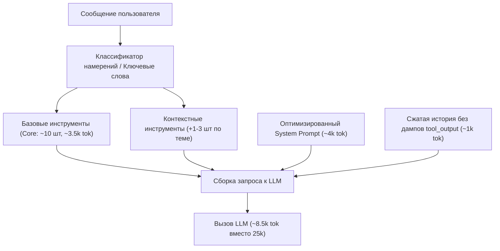

# План сокращения расхода токенов на каждый запрос к LLM

## Goal Description
Сейчас каждый запрос к любой модели отправляет фиксированную «базу» в **~23 300 токенов** (System prompt: 9 926 токенов + Спецификации 35 инструментов: 13 386 токенов), плюс историю и реплику пользователя. Из-за этого даже при вопросе из двух слов первый вызов расходует ~25k токенов, а при вызове инструментов ход обходится в **~50k токенов**.

Цель: **сократить базовый контекст с 23.3k до ~7.5k – 8.5k токенов (в 2.5–3 раза)** без потери точности работы бота, медицинских гардрейлов и логирования.

---

## User Review Required

> [!IMPORTANT]
> **Динамическая фильтрация инструментов:**
> Мы предлагаем разделить 35 инструментов на:
> 1. **Core (постоянные, ~10 инструментов, ~3.5k токенов):** еда, вода, вес, холодильник, статус-бар, сводка дня, справка, база знаний (`log_food`, `log_water`, `log_weight`, `pantry`, `get_status_bar`, `get_day_summary`, `get_trends`, `help`, `knowledge`).
> 2. **Contextual (по ключевым словам/намерениям пользователя, ~2-4 инструмента при необходимости):**
>    - Фарма (`pharma`, `drug_card_draft`, `log_med`) — только если в сообщении или истории речь об уколах, дозах, препаратах.
>    - Сон (`log_sleep`) — если речь о сне/ночи.
>    - Тренировки/инвентарь (`log_workout`, `equipment`) — если речь о тренировках.
>    - Анализы (`log_labs`) — если прислали анализы крови.
>    - Болезнь/рефид (`sick`, `refeed`) — при словах о болезни/перерыве.
>    - Админка (`admin_cmd`) — строго в режиме admin.
>
> *Вопрос пользователю:* Согласны ли вы с разделением инструментов на базовые + контекстные, или предпочтительнее отдавать все инструменты разом, но в максимально сжатом виде?

---

## Proposed Changes



### 1. Компонент: Схемы инструментов (`plugin/schemas.py` и `bot/registry.py`)

#### [MODIFY] `bot/registry.py`
- Удалить поле `user_id` из схем при генерации `openai_tools()`: бот работает локально через `ContextVar` (`registry.set_caller(uid)`), модели никогда не нужно заполнять `user_id`. Это сразу экономит ~700 токенов.
- Реализовать функцию `get_active_tools(text: str, history: list[dict], is_admin: bool) -> list[dict]`, которая возвращает Core-набор + активированные по ключевым паттернам инструменты.
- Реализовать флаг fallback: если модель не нашла нужного действия или попросила тул — передавать полный набор.

#### [MODIFY] `plugin/schemas.py`
- Убрать многословные комментарии в `description` свойств внутри сложных схем (`log_food`, `log_weight`, `pharma`, `plans`), оставив строгие и краткие спецификации типов и форматов.

---

### 2. Компонент: Системный промпт (`Core/system_promt.md` и `bot/main.py`)

#### [MODIFY] `bot/main.py`
- Устранить дублирование тем знаний: сейчас `knowledge.index()` пишется в текст системного промпта, а `knowledge.schema()` параллельно передаёт список тех же файлов в `enum` инструмента `knowledge`. Оставить индекс в описании инструмента, убрав 790 токенов из системного промпта.

#### [MODIFY] `Core/system_promt.md`
- Сжать инструкцию с 20 500 до ~10 000 символов (~4 000 токенов вместо 9 136):
  - Убрать повторение правил вызова инструментов (они уже описаны в схемах тулов).
  - Сохранить на 100% медицинские гардрейлы, клинические границы, правила титрации и тональность коуча.

---

### 3. Компонент: История диалога (`bot/history.py`)

#### [MODIFY] `bot/history.py`
- При сохранении/загрузке истории для tool-сообщений (`role: "tool"`):
  - Сжимать объёмные JSON-ответы инструментов (например, длинные списки продуктов холодильника или многострочные статус-бары), оставляя для истории краткую квинтэссенцию (`{"status": "ok", "summary": ...}`).
  - Это удержит размер истории в пределах 800–1200 токенов даже при длинном диалоге.

---

## Verification Plan

### Automated Tests
1. Запуск тестового набора бота:
   ```bash
   .venv/bin/python test_bot.py
   .venv/bin/python test_e2e.py
   ```
2. Проверка корректности работы всех 35 инструментов через `registry.dispatch`.
3. Тест динамического отбора инструментов:
   - Сообщение «съел 200г творога» $\rightarrow$ тулы `log_food`, `pantry`, `get_day_summary` присутствуют.
   - Сообщение «уколол 2.5мг» $\rightarrow$ подключен `pharma`, `log_med`.
   - Сообщение «какой пульс» $\rightarrow$ подключен `get_trends`.

### Сравнение расхода токенов (Метрика успеха)
Запустить скрипт подсчёта размера базового контекста:
- Базовый контекст ДО: **23 312 токенов**.
- Базовый контекст ПОСЛЕ: **$\le$ 8 500 токенов** (снижение на $\ge 60\%$).
