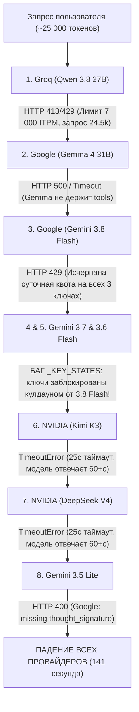

# Анализ причин сбоя: «Не могу связаться с моделью»

## 1. Суть проблемы
Пользователь видит в Telegram ошибку:
> *«Не смог связаться с моделью. Записи в базе не потеряны, повтори через минуту.»*

Ответ приходит с задержкой в **141 секунду (более 2 минут)**. В системном журнале зафиксировано:
```
Sep 14 07:49:12 ERROR bot все провайдеры недоступны: Все провайдеры упали:
qwen/qwen3.8-27b: 429/413 RateLimit/Quota
gemma-4-31b-it: HTTP 500 / TimeoutError
gemini-3.8-flash: 429 Quota Exceeded (все 3 ключа)
moonshotai/kimi-k3: TimeoutError (25s)
deepseek-ai/deepseek-v4-flash-0731: TimeoutError (25s)
gemini-3.5-flash-lite: HTTP 400 missing thought_signature
```

---

## 2. Пошаговый разбор падения каждого провайдера в цепочке

В файле `config.yaml` настроена цепочка из 8 провайдеров. Вот точная причина отказа каждого из них:



---

### Провайдер 1: `qwen/qwen3.8-27b` на Groq
* **Ошибка в логе:**
  `HTTP 413 / 429: Request too large for model 'qwen/qwen3.8-27b' on input tokens per minute (ITPM): Limit 7000, Requested 24391`
* **Причина:** На бесплатном тарифе Groq для Qwen установлен жёсткий потолок: **7 000 входных токенов в минуту**. Бот отправляет **~24 500 токенов** в первом же запросе.
* **Вывод:** Модель Qwen на Groq с текущим промптом **физически не может обработать ни один запрос бота**.

---

### Провайдер 2: `gemma-4-31b-it` (Google AI Studio)
* **Ошибка в логе:** `HTTP 500: Internal error encountered`, `HTTP 400`, `TimeoutError`.
* **Причина:** Модель Gemma на эндпоинте OpenAI-compatible у Google либо перегружена (500), либо падает по таймауту, либо некорректно обрабатывает схемы вызова инструментов (tools).

---

### Провайдер 3: `gemini-3.8-flash` (Google AI Studio, 3 API-ключа)
* **Ошибка в логе:**
  `HTTP 429: You exceeded your current quota, please check your plan and billing details.`
* **Причина:** Все 3 зарегистрированных Google API-ключа (`...4QjQ`, `...pZpQ`, `..._oog`) **полностью исчерпали суточный лимит бесплатных запросов (Daily Quota Exceeded)** из-за активной переписки в течение дня (каждый ход съедал по 50k токенов).

---

### Провайдеры 4 и 5: `gemini-3.7-flash` и `gemini-3.6-flash` (Скрытый архитектурный баг)
* **Что произошло:** Модель `gemini-3.6-flash` была даже не опробована (хотя наш прямой тест показал, что на ключах `...4QjQ` и `...pZpQ` модель `gemini-3.6-flash` отвечает со статусом 200!).
* **Причина — баг в `bot/llm.py`:**
  В файле `bot/llm.py`:
  ```python
  # bot/llm.py:42
  _KEY_STATES: dict[str, KeyState] = {}
  ```
  Состояние кулдауна привязано **только к строке API-ключа**, а не к паре `(модель, ключ)`.
  1. `gemini-3.8-flash` получил 429 на всех трёх ключах и установил `state.cooldown_until = now + 60s`.
  2. Когда очередь дошла до `gemini-3.7-flash` и `gemini-3.6-flash`, функция `_ordered_keys` увидела, что все ключи в состоянии кулдауна, и цикл `for key in ordered_keys` **пропустил все ключи без единого HTTP-запроса**!
  3. В итоге рабочая модель `gemini-3.6-flash` оказалась заблокирована чужой ошибкой.

---

### Провайдеры 6 и 7: `moonshotai/kimi-k3` и `deepseek-ai/deepseek-v4-flash-0731` (NVIDIA)
* **Ошибка в логе:** `TimeoutError()`.
* **Причина:**
  В `config.yaml` для этих моделей выставлены тяжёлые параметры рассуждения:
  `reasoning_effort: max` и `thinking: true`.
  Прямой тест показал, что `integrate.api.nvidia.com` отвечает на такие запросы **дольше 30–60 секунд**.
  При этом в `bot/llm.py` установлен жёсткий таймаут чата:
  ```python
  DEFAULT_TIMEOUT_S = 25.0
  ```
  Через 25 секунд бот обрывает соединение с NVIDIA по таймауту, не дождавшись ответа.

---

### Провайдер 8: `gemini-3.5-flash-lite`
* **Ошибка в логе:**
  `HTTP 400: Function call is missing a thought_signature in functionCall parts.`
* **Причина:** Новое требование Google API к моделям с рассуждениями при передаче `tool_calls`.

---

## 3. План устранения проблемы (Рекомендации к будущему применению)

1. **Исправление бага взаимной блокировки ключей в `bot/llm.py`:**
   Привязать кулдаун не к `key`, а к `(provider['model'], key)`:
   ```python
   def _get_key_state(model: str, key: str) -> KeyState:
       k = f"{model}:{key}"
       ...
   ```
   Это позволит рабочей модели `gemini-3.6-flash` отвечать, даже если у `gemini-3.8-flash` кончилась квота.

2. **Корректировка таймаута для NVIDIA reasoning-моделей:**
   В `config.yaml` или `bot/llm.py` передавать `timeout_s` из настроек провайдера (например, 60–90с для Kimi и DeepSeek, либо убрать `reasoning_effort: max` из регулярного чата).

3. **Отключение заведомо нерабочих на free-tier моделей из начала цепочки:**
   Убрать `qwen/qwen3.8-27b` с Groq из начала списка: при лимите в 7k токенов он никогда не примет 24k промпт бота и только добавляет задержку и ошибки 413.
