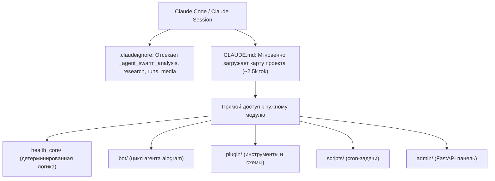

# План: Создание CLAUDE.md и .claudeignore для оптимизации расхода токенов Claude

## Goal Description
При работе Claude (в частности Claude Code и AI-агентов) с репозиторием `health_agent_system` расходуется избыточное количество токенов. Причины:
1. **Отсутствие входного индекса проекта**: Claude вынужден сканировать файловую систему, исследовать каталоги и читать тяжелые файлы (`SPEC.md` на 57 КБ, `architecture.html` на 82 КБ, `DEPLOY.md` на 19 КБ, `plugin/tools.py` на 352 КБ, `health_core/guards.py` на 115 КБ).
2. **Служебные и исследовательские дампы**: Репозиторий содержит тяжелые каталоги отчетов и логов (`_agent_swarm_analysis/`, `research/`, `llm-council/runs/`, `Nutrition/`, `Metrics/*.xlsx`), которые попадают в контекст поиска (`grep`, `glob`, `find`) и тратят десятки тысяч токенов на каждый запрос.
3. **Незнание архитектурных границ**: Без четких правил агент может предлагать вычисления калорий внутри промпта или импортировать `bot` в `health_core`, что противоречит жестким инвариантам проекта.

**Цель**: Создать эталонный, высокоплотный файл `CLAUDE.md` в корне проекта (автоматически считываемый Claude Code) и файл `.claudeignore`, которые обеспечат:
- Мгновенную ориентацию Claude в архитектуре, назначении каталогов и ключевых файлов без чтения тяжелых спецификаций;
- Четкие правила навигации: прямой переход к целевому модулю вместо поиска по всему проекту;
- Строгие правила экономии токенов (не читать гигантские файлы целиком, использовать срезы строк и grep);
- Игнорирование тяжелых дампов, логов и бинарных файлов через `.claudeignore`;
- Справочник команд запуска тестов и сервисов с использованием правильного `.venv/bin/python`.

---

## User Review Required

> [!IMPORTANT]
> **Имя и формат основного файла:**
> По умолчанию для Claude Code стандартом является файл **`CLAUDE.md`** в корне репозитория — CLI-агент Claude автоматически считывает его при старте сессии, экономя первичное исследование.
> Предлагается создать:
> 1. `CLAUDE.md` — основной файл инструкций и структуры для Claude Code на русском языке (с сохранением точных путей и имен символов).
> 2. `.claudeignore` — список исключений (тяжелые дампы swarm-анализа, исследования, логи прогонов консилиума, xlsx/docx), предотвращающий их индексацию инструментом ripgrep/glob в сессиях Claude.
> 
> Если вам также требуется отдельная копия с другим именем (например, `PROJECT_STRUCTURE.md`), укажите это.

---

## Open Questions

1. **Дополнительный алиас файла**: Достаточно ли размещения файла под стандартным именем `CLAUDE.md` в корне, или вы хотите создать симлинк / копию `PROJECT_STRUCTURE.md` для ручного использования в других чатах с Claude?
2. **Степень детализации схем инструментов**: Включать ли в `CLAUDE.md` краткую таблицу всех 35 инструментов с их назначением, или ограничиться группировкой по категориям (еда, фарма, анализы, тренировки, консилиум и т.д.) для сохранения минимального размера файла (~150-250 строк)? *(Рекомендуется: группировка по функциональным блокам с точными ссылками на модули, чтобы сам `CLAUDE.md` не превышал 2.5–3 тыс. токенов).*

---

## Proposed Changes



### Документация и конфигурация Claude

#### [NEW] [CLAUDE.md](file:///opt/webapps/health_agent_system/CLAUDE.md)
Создание файла со следующей структурой:
1. **Паспорт проекта**:
   - Метаболический контур: Telegram-бот для снижения жировой массы с сохранением мышц на терапии GLP-1.
   - Стек: Python 3.13 (`.venv/bin/python`), aiogram 3, SQLite (`health.db`), FastAPI (admin), systemd.
2. **Ключевые инварианты (Architecture Invariants)**:
   - *Детерминированная арифметика*: LLM никогда не считает калории, дефициты, дозировки и даты. Все расчеты — чистый Python в `health_core/`.
   - *Единственный источник истины*: SQLite (`health.db`). В переписке фактура не хранится.
   - *Изоляция слоев*: `health_core/` не знает о `bot/`, Telegram и сети. Граница с ботом — через `plugin/tools.py` и `bot/registry.py`.
3. **Карта каталогов и файлов (Directory Map)**:
   - `health_core/`:
     - `energy.py`: калораж, BMR, TDEE, лимит Alpert (69.3 ккал/кг жира), пол калорий (`kcal_floor`).
     - `guards.py`: 12+ клинических гардрейлов (желчный пузырь, белок, темп снижения, титрация).
     - `db.py`: схема SQLite, миграции, подключение.
     - `glp1.py`, `meds.py`: фармакокинетика GLP-1, лестницы титрации, запас препарата в днях.
     - `chrono.py`: таймзоны, окна приемов пищи (завтрак, обед, ужин, перекус).
     - `card_drafts.py`: черновики карт лекарств из openFDA / ClinicalTrials.gov.
     - `labs.py`: анализы крови и расчетные индексы (HOMA-IR, eGFR, TyG, FIB-4).
     - `report.py`, `forecast.py`: статус-бар, сводки, прогноз снижения веса.
     - `sick.py`, `refeed.py`: режим болезни, фазы MATADOR.
     - `council_data.py`: детерминированный дата-пак для консилиума.
     - `ingest/`: парсеры весов (`scale.py`), Garmin/TCX (`tcx.py`), антропометрии (`anthro.py`), сна (`sleep.py`).
   - `bot/`:
     - `main.py`: запуск aiogram, allowlist, слэш-команды, быстрые макросы.
     - `llm.py`: цепочка провайдеров (Gemini, Groq, Nvidia, DeepSeek), tool-loop, prompt caching.
     - `registry.py`: реестр 35 инструментов, конвертер в формат OpenAI tools, диспетчер.
     - `history.py`: скользящее окно истории сообщений в SQLite.
     - `knowledge.py`: поиск по markdown-базе знаний (`Knowledge/`).
     - `council.py`: фоновый запуск независимых моделей-аналитиков и судьи.
   - `plugin/`:
     - `tools.py`: 35 хендлеров инструментов.
     - `schemas.py`: JSON Schema параметров.
   - `scripts/`:
     - CLI cron-скрипты с флагом `--no-agent`, вывод которых пересылается через `notify.py`.
   - `admin/`:
     - Панель FastAPI (`server.py`, `pages.py`, `auth.py`, `upload.py`).
   - `Core/`:
     - `system_promt.md`: системный промпт Telegram-бота (персона, стиль, ограничения).
   - `Knowledge/`:
     - Статьи базы знаний для инструмента `knowledge(topic)`.
4. **Правила экономии токенов для Claude (Token Saving Rules)**:
   - **Запрет чтения гигантских файлов целиком**: не читать `plugin/tools.py` (352 КБ) и `health_core/guards.py` (115 КБ) полностью — использовать точечный `grep` или срез строк.
   - **Игнорирование архивов**: никогда не загружать в контекст `_agent_swarm_analysis/`, `research/`, `llm-council/runs/`, `Nutrition/`, `Metrics/*.xlsx`, `architecture.html`, `SPEC.md`.
   - **Навигация по карте**: при решении задачи смотреть в раздел карты и читать только конкретный файл.
5. **Команды разработки и проверок**:
   - Запуск тестов: `.venv/bin/python test_bot.py` (25 сценариев) и `.venv/bin/python test_e2e.py` (10 стадий).
   - Запуск модуля: `.venv/bin/python -m health_core.<name>` или `.venv/bin/python -m bot.<name>`.
   - Проверка синтаксиса: `.venv/bin/python -m py_compile <file>`.

#### [NEW] [.claudeignore](file:///opt/webapps/health_agent_system/.claudeignore)
Создание файла со списком директорий и шаблонов, исключаемых из поиска Claude Code:
```
# Вспомогательные аналитические и исследовательские дампы
_agent_swarm_analysis/
research/
llm-council/runs/

# Тяжелые пользовательские данные и дневники
Nutrition/
Metrics/*.xlsx
Metrics/*.csv
Metrics/*.tcx

# HTML-визуализации архитектуры
architecture.html
Docs/architecture.html

# Устаревшие материалы Hermes и бэкапы
Docs/hermes_ref/
Docs/code_analysis/
Docs/skills_analysis/
config.bak
gemini_edited/

# Окружение Python и артефакты сборки
.venv/
__pycache__/
*.pyc
*.egg-info/
```

---

## Verification Plan

### Automated Tests
1. **Проверка синтаксиса и структуры файлов**:
   - Убедиться, что `CLAUDE.md` и `.claudeignore` созданы в `/opt/webapps/health_agent_system/`.
   - Проверить размер `CLAUDE.md` (целевой объем: ~150-250 строк, чтобы он оставался легким и информативным).
2. **Проверка работоспособности тестового контура проекта**:
   - Выполнить `.venv/bin/python test_bot.py` — убедиться в успешном прохождении всех 25 тестов (0 упало).
   - Выполнить `.venv/bin/python test_e2e.py` — убедиться в прохождении всех 10 стадий.
3. **Проверка правил `.claudeignore`**:
   - Проверить, что пути из `.claudeignore` корректно соответствуют существующим тяжелым директориям.

### Manual Verification
1. Открыть `CLAUDE.md` и убедиться, что:
   - Описание архитектуры и зон ответственности каждого каталога исчерпывающе и точно.
   - Ссылки на файлы кликабельны и ведут на существующие модули.
   - Инварианты проекта (детерминированная математика, SQLite как источник истины, изоляция `health_core`) акцентированы.
   - Правила сокращения расхода токенов понятны и недвусмысленны.
