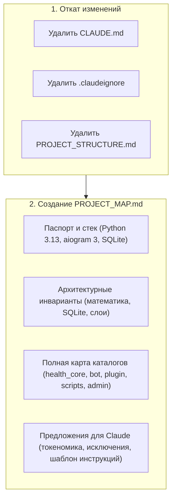

# План: Карта проекта и предложения для самостоятельной настройки инструкций Claude

## Goal Description
Пользователь скорректировал задачу:
1. **Откатить изменения**: удалить файлы `CLAUDE.md`, `.claudeignore` и симлинк `PROJECT_STRUCTURE.md`, не навязывая Claude жесткие служебные файлы в корне.
2. **Создать карту проекта (`PROJECT_MAP.md`)**: подготовить чистый, структурированный документ с детальным описанием архитектуры, зон ответственности всех каталогов и файлов проекта.
3. **Подготовить рекомендации для Claude**: включить в документ раздел с конкретными предложениями и готовым шаблоном инструкций, чтобы Claude мог автономно ознакомиться с ними и при необходимости самостоятельно сформулировать или переписать свои рабочие инструкции под конкретную задачу.

---

## User Review Required

> [!IMPORTANT]
> **План отката:**
> Файлы `CLAUDE.md`, `.claudeignore` и `PROJECT_STRUCTURE.md` были созданы в предыдущей итерации как новые файлы (в git они не отслеживались).
> При выполнении они будут полностью удалены без потери какой-либо исходной информации репозитория.

> [!NOTE]
> **Формат и размещение карты проекта:**
> Документ будет размещен в корне проекта под нейтральным именем `PROJECT_MAP.md`.
> Он разбит на две части:
> 1. *Архитектурная карта проекта*: зоны ответственности, модули, границы слоев, 35 инструментов, инварианты.
> 2. *Руководство и предложения для Claude*: правила токеномики (какие файлы не читать целиком, какие дампы игнорировать), инварианты кодинга, команды верификации и компактный шаблон самоинструкции.

---

## Open Questions
- Согласны ли вы с размещением файла в корне репозитория как `PROJECT_MAP.md`, или предпочтительнее разместить его в подкаталоге `docs/` (например, `docs/PROJECT_MAP.md`)? *(Рекомендуется: `PROJECT_MAP.md` в корне для быстрого доступа).*

---

## Proposed Changes

### Откат служебных файлов Claude

#### [DELETE] [CLAUDE.md](file:///opt/webapps/health_agent_system/CLAUDE.md)
Удаление созданного файла инструкции.

#### [DELETE] [.claudeignore](file:///opt/webapps/health_agent_system/.claudeignore)
Удаление файла исключений для Claude Code.

#### [DELETE] [PROJECT_STRUCTURE.md](file:///opt/webapps/health_agent_system/PROJECT_STRUCTURE.md)
Удаление созданного симлинка.

---

### Карта проекта и рекомендации

#### [NEW] [PROJECT_MAP.md](file:///opt/webapps/health_agent_system/PROJECT_MAP.md)
Создание документа, содержащего:

1. **Паспорт проекта**:
   - Назначение: Метаболический контур — Telegram-ассистент для людей на терапии GLP-1 (контроль веса с сохранением мышц).
   - Стек: Python 3.13 (`.venv/bin/python`), aiogram 3, SQLite (`health.db`), FastAPI (admin), systemd.
2. **Базовые архитектурные инварианты**:
   - Детерминированная арифметика: модель никогда не считает калории, дефициты, дозы. Все вычисления — строгий Python в `health_core/`.
   - SQLite — единственный источник истины. История сообщений диалога фактуру не хранит.
   - Изоляция `health_core/` от бота и внешних транспортов.
   - Вызовы через `plugin/tools.py` и `bot/registry.py` с `ContextVar` пользователя.
3. **Детальная карта каталогов и файлов**:
   - `health_core/`: `db.py`, `energy.py` (Alpert 69.3 ккал/кг, пол калорий, БЖУ), `guards.py` (12+ клинических гардрейлов), `glp1.py`, `meds.py`, `card_drafts.py`, `chrono.py` (окна приемов пищи), `labs.py`, `hr_zones.py`, `report.py`, `forecast.py`, `refeed.py`, `sick.py`, `council_data.py`, `export.py`, `ingest/`.
   - `bot/`: `main.py`, `llm.py` (провайдеры, tool-loop, prompt caching), `registry.py` (35 инструментов, диспетчер), `history.py`, `knowledge.py`, `council.py`.
   - `plugin/`: `tools.py` (хендлеры), `schemas.py` (схемы параметров).
   - `scripts/`: cron-скрипты `--no-agent` (`dispatch.py`, `morning_checkin.py`, `evening_report.py`, `meal_window_check.py`, `weekly_recalc.py`, `injection_reminder.py`, `export_backup.py`, `notify.py`).
   - `admin/`: веб-панель FastAPI (`server.py`, `pages.py`, `auth.py`, `upload.py`).
   - `Core/`: системные промпты бота (`system_promt.md`, `instructions_for_ai.md`, `logic_and_workflow.md`).
   - `Knowledge/`: статьи для RAG-инструмента `knowledge`.
   - `config.yaml`: параметры политик, порогов и LLM.
4. **Справочник инструментов (35 шт. по 8 группам)**:
   - Питание/вода, вес/замеры, фарма/GLP-1, здоровье/анализы, спорт/активность, планирование/прогноз, дашборды/сводки, системные вызовы.
5. **Предложения для Claude по самонастройке и экономии токенов**:
   - *Стратегия токеномики*: запрет чтения тяжелых файлов (`plugin/tools.py` 352 КБ, `health_core/guards.py` 115 КБ, `SPEC.md` 57 КБ) целиком; поиск через `grep` или срез строк.
   - *Список директорий для игнорирования*: `_agent_swarm_analysis/`, `research/`, `llm-council/runs/`, `Nutrition/`, `Metrics/*.xlsx`, `architecture.html`, `gemini_edited/`.
   - *Инварианты при генерации кода*: сохранение типов, отсутствие импортов бота в `health_core`, проверка миграций БД.
   - *Команды проверки*: запуск `.venv/bin/python test_bot.py` и `.venv/bin/python test_e2e.py`.
   - *Готовый компактный фрагмент*: блок текста, который Claude может использовать как свой системный контекст для экономичной работы.

---

## Verification Plan

### Automated Tests
1. Проверка удаления `CLAUDE.md`, `.claudeignore`, `PROJECT_STRUCTURE.md`.
2. Проверка создания `PROJECT_MAP.md` и его размера.
3. Прогон наборов тестов:
   - `.venv/bin/python test_bot.py` (25 сценариев цикла агента без сети) -> убедиться в PASS.
   - `.venv/bin/python test_e2e.py` (10 стадий доменной логики) -> убедиться в PASS.

### Manual Verification
1. Открыть `PROJECT_MAP.md` и проверить:
   - Полноту и структурированность карты каталогов.
   - Ясность рекомендаций для Claude.
   - Наличие готового шаблона, который Claude может использовать для переписывания собственных инструкций.
