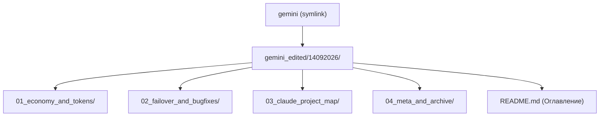

# План: Структурирование архива сессии в папке gemini_edited/14092026/ по подпапкам

## Goal Description
Пользователь запросил перенести все подготовленные материалы и планы текущей сессии в каталог `gemini/14092026` (ранее `gemini_edited/14092026`) и разложить все существующие файлы по тематическим подпапкам вместо хранения сплошным плоским списком.

Цель:
1. Создать логичную структуру подпапок внутри `gemini_edited/14092026/`.
2. Распределить ранее созданные отчеты и новые материалы текущей сессии по соответствующим подпапкам.
3. Создать симлинк `gemini -> gemini_edited` в корне репозитория для поддержки обоих путей (`gemini/14092026` и `gemini_edited/14092026`).
4. Обновить корневой `README.md` в `gemini_edited/14092026/` с навигацией по всем подпапкам.
5. Сохранить рабочий файл `PROJECT_MAP.md` в корне репозитория (в архив поместить его синхронизированную копию).

---

## User Review Required

> [!IMPORTANT]
> **Предлагаемая структура подпапок внутри `gemini_edited/14092026/`:**
> 
> - **`01_economy_and_tokens/`** (исследования токенов и кэширования):
>   - `research_prompt_caching_and_optimization.md`
>   - `caching_and_fastpath_plan.md`
>   - `token_optimization_plan.md`
>   - `transfer_economy_reports_plan.md`
> 
> - **`02_failover_and_bugfixes/`** (исправление провайдеров и таймаутов):
>   - `provider_failure_analysis_plan.md`
>   - `fix_provider_failover_and_timeouts_plan.md`
>   - `walkthrough_failover.md` (отчет о внедрении фиксов в `llm.py` и `config.yaml`)
> 
> - **`03_claude_project_map/`** (карта проекта и оптимизация для Claude):
>   - `PROJECT_MAP.md` (архивная копия карты проекта)
>   - `claude_token_optimization_plan.md` (план 1: исходный план для CLAUDE.md)
>   - `project_map_and_claude_proposals_plan.md` (план 2: план отката и нейтральной карты)
>   - `walkthrough_project_map.md` (отчет о создании карты проекта и отката)
> 
> - **`04_meta_and_archive/`** (мета-планы архивации сессий):
>   - `archive_session_artifacts_plan.md`
> 
> - **`README.md`** (в корне `gemini_edited/14092026/`):
>   - Общее структурированное оглавление со ссылками на все подкаталоги и файлы.

> [!NOTE]
> **Алиас каталога:**
> В корне проекта будет создан симлинк `gemini -> gemini_edited`, чтобы команды и ссылки `gemini/14092026/...` работали одинаково прозрачно.

---

## Open Questions
- Устраивает ли вас такое разделение на 4 тематические подпапки с числовыми префиксами для упорядочивания по смыслу?

---

## Proposed Changes

### 1. Каталоги и организация файлов

#### [NEW] [gemini_edited/14092026/01_economy_and_tokens/](file:///opt/webapps/health_agent_system/gemini_edited/14092026/01_economy_and_tokens/)
Перемещение файлов по анализу токенов и кэшированию:
- `research_prompt_caching_and_optimization.md`
- `caching_and_fastpath_plan.md`
- `token_optimization_plan.md`
- `transfer_economy_reports_plan.md`

#### [NEW] [gemini_edited/14092026/02_failover_and_bugfixes/](file:///opt/webapps/health_agent_system/gemini_edited/14092026/02_failover_and_bugfixes/)
Перемещение файлов по сбоям провайдеров и их устранению:
- `provider_failure_analysis_plan.md`
- `fix_provider_failover_and_timeouts_plan.md`
- `walkthrough_failover.md` (переименованный исходный `walkthrough.md` первой сессии)

#### [NEW] [gemini_edited/14092026/03_claude_project_map/](file:///opt/webapps/health_agent_system/gemini_edited/14092026/03_claude_project_map/)
Копирование и сохранение материалов текущей сессии:
- `PROJECT_MAP.md` (копия карты проекта)
- `claude_token_optimization_plan.md` (план создания CLAUDE.md)
- `project_map_and_claude_proposals_plan.md` (план отката и создания PROJECT_MAP.md)
- `walkthrough_project_map.md` (отчет о реализации карты проекта)

#### [NEW] [gemini_edited/14092026/04_meta_and_archive/](file:///opt/webapps/health_agent_system/gemini_edited/14092026/04_meta_and_archive/)
- `archive_session_artifacts_plan.md`

#### [NEW] Симлинк `gemini -> gemini_edited`
Создание символической ссылки в корне репозитория для поддержки пути `gemini/14092026/`.

#### [MODIFY] [gemini_edited/14092026/README.md](file:///opt/webapps/health_agent_system/gemini_edited/14092026/README.md)
Полная переработка корневого `README.md` архива:
- Включение всех 4 категорий;
- Таблицы ссылок на каждую подпапку и файл с аннотациями;
- Сводка ключевых технических итогов сессии 14.09.2026.

---

## Verification Plan

### Automated Tests
1. **Проверка файловой структуры**:
   - `ls -la gemini_edited/14092026/` — убедиться в наличии подпапок и отсутствии разрозненных файлов в корне.
   - `tree` или `find gemini_edited/14092026 -type f` — проверить наличие всех файлов в соответствующих каталогах.
   - Проверка симлинка `ls -ld gemini`.
2. **Проверка работоспособности системы**:
   - Запуск `.venv/bin/python test_bot.py` (25 сценариев) -> убедиться в PASS.
   - Запуск `.venv/bin/python test_e2e.py` (10 стадий) -> убедиться в PASS.

### Manual Verification
1. Открыть `gemini_edited/14092026/README.md` и проверить корректность относительных ссылок на все файлы в подкаталогах.
2. Проверить доступность файлов по обоим путям (`gemini/14092026/...` и `gemini_edited/14092026/...`).
